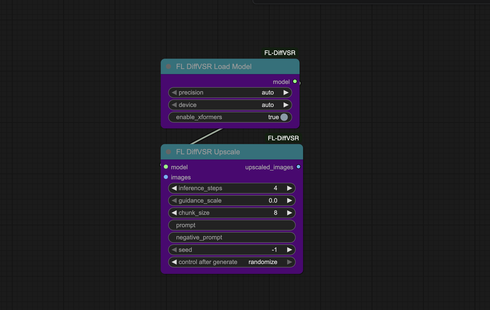

# FL DiffVSR

Diffusion-based video super-resolution nodes for ComfyUI powered by Stream-DiffVSR. Upscale videos 4x with temporal coherence for smooth, artifact-free results.

[](https://arxiv.org/abs/2512.23709)
[](https://www.patreon.com/Machinedelusions)



## Features

- **4x Video Upscaling** - Upscale video frames to 4x resolution with high fidelity
- **Temporal Coherence** - Maintains consistency across frames for flicker-free results
- **Diffusion-Based** - Leverages diffusion models for superior detail reconstruction
- **Text Guidance** - Optional prompt support for guided upscaling
- **Memory Efficient** - Chunked processing and xformers support for lower VRAM usage
- **Automatic Downloads** - Models download automatically from HuggingFace on first use

## Nodes

| Node | Description |
|------|-------------|
| **FL DiffVSR Load Model** | Downloads and loads Stream-DiffVSR model from HuggingFace |
| **FL DiffVSR Upscale** | Upscales video frames with temporal coherence |

## Installation

### ComfyUI Manager
Search for "FL DiffVSR" and install.

### Manual
```bash
cd ComfyUI/custom_nodes
git clone https://github.com/filliptm/ComfyUI-FL-DiffVSR.git
cd ComfyUI-FL-DiffVSR
pip install -r requirements.txt
```

## Quick Start

1. Add **FL DiffVSR Load Model** node and configure precision/device settings
2. Connect to **FL DiffVSR Upscale** node
3. Feed your video frames as an IMAGE batch
4. Adjust inference steps (4 recommended for speed/quality balance)
5. Generate upscaled frames

## Parameters

### Model Loader
| Parameter | Options | Description |
|-----------|---------|-------------|
| precision | auto, fp32, fp16, bf16 | Model precision (auto selects fp16 for GPU) |
| device | auto, cuda, cpu | Target device for inference |
| enable_xformers | true/false | Enable memory-efficient attention |

### Upscaler
| Parameter | Default | Description |
|-----------|---------|-------------|
| inference_steps | 4 | Denoising steps (higher = better quality, slower) |
| guidance_scale | 0.0 | CFG scale (0 = no guidance) |
| chunk_size | 8 | Frames per batch (lower = less VRAM) |
| prompt | "" | Optional text guidance |
| negative_prompt | "" | Optional negative prompt |
| seed | -1 | Random seed (-1 for random) |

## Requirements

- Python 3.10+
- 8GB VRAM minimum (16GB+ recommended for larger videos)
- NVIDIA GPU recommended (CPU supported but slow)

## Model

The Stream-DiffVSR model downloads automatically to `ComfyUI/models/stream_diffvsr/` on first use (~2GB).

| Model | Source | Size |
|-------|--------|------|
| Stream-DiffVSR | Jamichsu/Stream-DiffVSR | ~2GB |

## License

Apache 2.0
